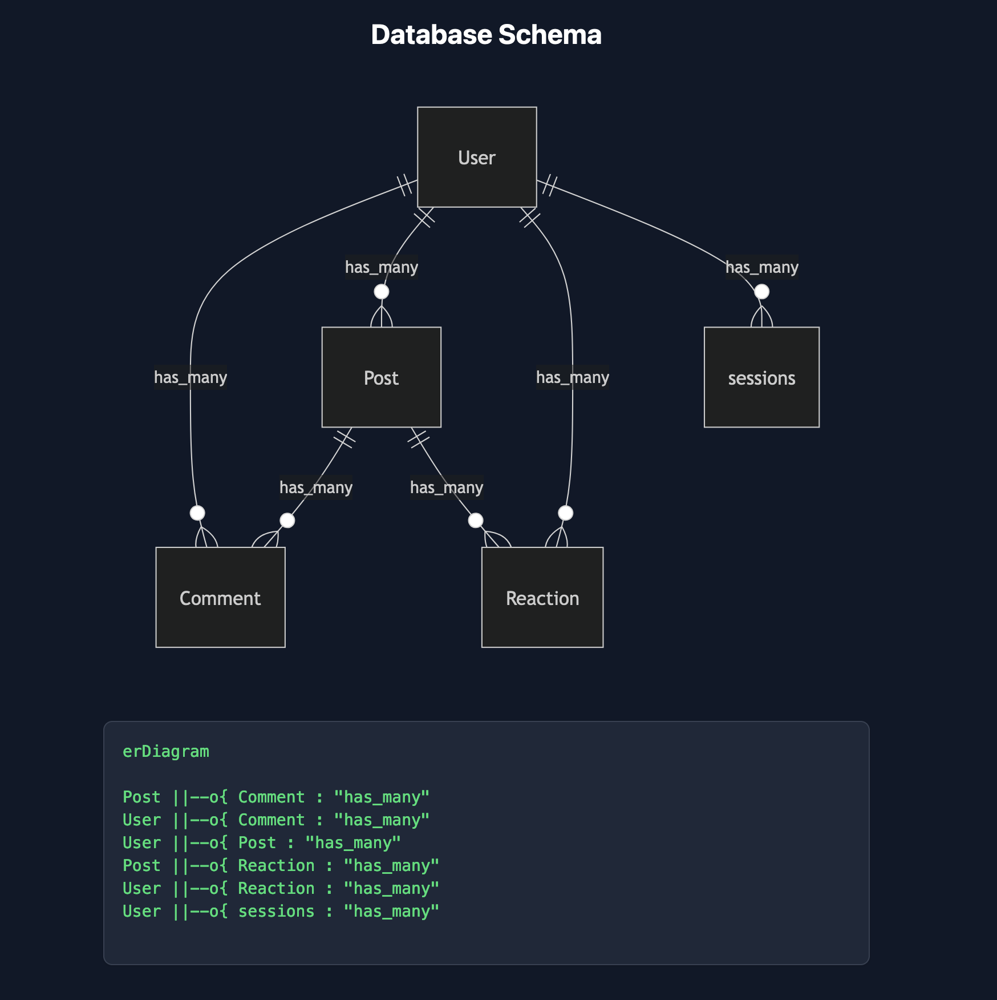

## DbChart

This package is a simple package that allows you to generate a Mermaid diagram of your database schema. It will update in real time as you make changes to your database.



> [!WARNING]
> This package is intended for development use only and is simply a POC. Do not use in production environments as it exposes your database schema.


## Installation

```bash
composer require dynamikdev/db-chart
```

## Usage

Visit `/db-chart` to see the diagram!.

## Configuration

### Authorization

You can configure the package by adding a callback to the `DbChartServiceProvider` class. Here's an example of how to authorize the diagram to only be visible to authenticated users.

```php
// AppServiceProvider.php
public function register()
{
    DbChartServiceProvider::authorizeUsing(function () {
        return auth()->check();
    });
}
```


